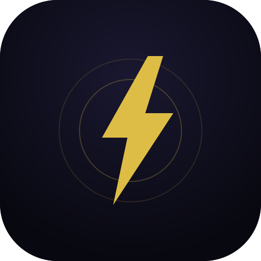

# tap.connect ⚡

> Tap phones to instantly exchange profiles at networking events — no awkward intros, no fumbling for LinkedIn.



---

## The Problem

You're at a startup meetup. You spot someone interesting. But walking up cold and saying *"hey can I have your LinkedIn?"* feels awkward — so you don't. You leave with 0 new connections.

**tap.connect fixes this.** One tap and both phones reveal each other's profiles simultaneously, with an AI insight on why you'd click.

---

## How It Works

1. **One person** hits "Start Tapping" → gets a 6-digit code or QR
2. **Other person** scans the QR or enters the code
3. Both screens **reveal each other's profiles** at the same time
4. AI shows **"Why you'll click"** — mutual interests, complementary goals
5. Save the connection, generate a follow-up message, done

### Three tap methods — auto-detected

| Method | Works on | Speed |
|--------|----------|-------|
| 📡 **NFC** | Android + Android (Chrome) | ~1 second, hold phones together |
| 📷 **QR Code** | Any phone with a camera | ~3 seconds, scan their screen |
| 🔢 **6-digit code** | Any phone, any browser | ~5 seconds, read it out loud |

The app detects what's available on the device and picks the best method automatically.

---

## Features

- ⚡ **Instant mutual reveal** — both profiles appear at the same time
- 🤖 **AI-powered matching** — Claude generates a "Why you'll click" insight per pair
- 📱 **PWA** — installs to home screen, works offline for saved connections
- 📡 **NFC support** — Android Chrome, true tap-to-connect
- 📷 **QR scanner** — built-in camera scanner, no extra app needed
- ✍️ **AI follow-up drafts** — one-tap to generate a personalised message
- 🤝 **Connection history** — searchable network from all your events
- 📤 **CSV export** — take your connections into any CRM
- 🔒 **Row-level security** — Supabase RLS, users only see their own data

---

## Tech Stack

| Layer | Tech |
|-------|------|
| Frontend | React 18 + Vite |
| Routing | React Router v6 |
| State | Zustand |
| Backend / DB | Supabase (Postgres + Realtime + Auth) |
| AI | Anthropic Claude API (`claude-sonnet-4-20250514`) |
| QR generation | qrcode.react |
| QR scanning | jsQR (camera-based) |
| NFC | Web NFC API (Android Chrome) |
| PWA | vite-plugin-pwa + Workbox |
| Deploy | Vercel |

---

## Getting Started

### Prerequisites

- Node.js ≥ 18
- A [Supabase](https://supabase.com) account (free tier works)
- An [Anthropic API key](https://console.anthropic.com) (optional — app works without it)

### 1. Clone & install

```bash
git clone https://github.com/yourusername/tapconnect.git
cd tapconnect
npm install
```

### 2. Set up Supabase

1. Create a new project at [supabase.com](https://supabase.com)
2. Go to **SQL Editor** → paste the contents of `SUPABASE_SCHEMA.sql` → click **Run**
3. Go to **Database → Replication** → enable Realtime for the `tap_rooms` table
4. Go to **Settings → API** → copy your `Project URL` and `anon public` key

### 3. Configure environment variables

```bash
cp .env.example .env
```

Fill in your `.env`:

```env
VITE_SUPABASE_URL=https://your-project.supabase.co
VITE_SUPABASE_ANON_KEY=your_anon_key_here
VITE_ANTHROPIC_API_KEY=sk-ant-your_key_here   # optional
```

### 4. Run locally

```bash
npm run dev
```

Open [http://localhost:3000](http://localhost:3000)

### 5. Test the tap flow

Open the app in **two browser tabs** to simulate two users:

- Tab 1 → Sign up as Person A → complete profile onboarding
- Tab 2 → Sign up as Person B → complete profile onboarding
- Tab 1 → "Start Tapping" → "Show Code"
- Tab 2 → "Enter Code" → type the 6 digits
- Both tabs hit the match screen simultaneously ✅

---

## Deployment (Vercel)

```bash
npm install -g vercel
vercel --prod
```

Then add your environment variables in **Vercel Dashboard → Settings → Environment Variables**.

> **Note:** NFC and the PWA install prompt require HTTPS. Vercel provides this automatically.

---

## Project Structure

```
tapconnect/
├── public/
│   ├── manifest.json          # PWA manifest
│   ├── offline.html           # Offline fallback page
│   └── icons/                 # PWA icons (192, 512, 180px)
├── src/
│   ├── components/
│   │   ├── AppShell.jsx       # Layout + bottom nav
│   │   ├── TapScreen.jsx      # Core tap UI (NFC / QR / code)
│   │   └── InstallPrompt.jsx  # PWA install banner
│   ├── lib/
│   │   ├── supabase.js        # DB helpers (auth, rooms, connections)
│   │   ├── ai.js              # Claude API — insights + follow-ups
│   │   └── tap.js             # NFC, QR scanner, tap engine
│   ├── pages/
│   │   ├── AuthPage.jsx       # Sign in / sign up
│   │   ├── OnboardingPage.jsx # 4-step profile setup
│   │   ├── HomePage.jsx       # Main tap screen
│   │   ├── MatchPage.jsx      # Profile reveal + AI insight
│   │   ├── JoinPage.jsx       # NFC deep link handler (/join/:code)
│   │   ├── ConnectionsPage.jsx# Saved network + search + CSV export
│   │   └── ProfilePage.jsx    # View + edit your profile
│   ├── stores/
│   │   └── useStore.js        # Zustand global state
│   ├── App.jsx                # Router + auth listener
│   └── main.jsx               # React entry point
├── SUPABASE_SCHEMA.sql        # Full DB schema — run once
├── vite.config.js             # Vite + PWA plugin config
└── .env.example               # Environment variable template
```

---

## Database Schema

```
profiles       — user profile (name, role, company, tags, intent, color)
tap_rooms      — 6-digit code rooms with creator/joiner and realtime status
connections    — saved pairs with AI insight and private notes
events         — event context for organiser dashboard (coming soon)
```

All tables use Supabase Row Level Security — users can only read/write their own data.

---

## Roadmap

- [ ] Event organiser dashboard (analytics, attendee management)
- [ ] LinkedIn OAuth for one-tap profile import
- [ ] Push notifications for follow-up reminders
- [ ] Team/company tap mode
- [ ] Event-scoped connection feeds
- [ ] Android native app (Flutter)

---

## Contributing
Contributions are welcome for non-core modules. Please open an issue before submitting a pull request. See CONTRIBUTING.md for guidelines.

PRs welcome. For major changes, open an issue first.

```bash
git checkout -b feature/your-feature
git commit -m "feat: your feature"
git push origin feature/your-feature
```

---

## License

MIT © 2026 Naitik — built with ⚡ and too much coffee